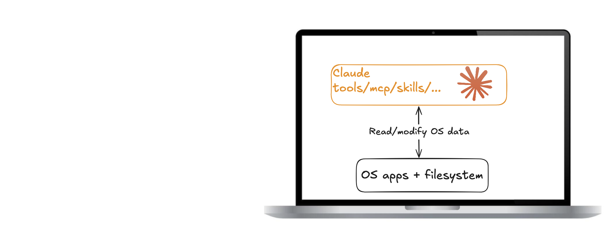
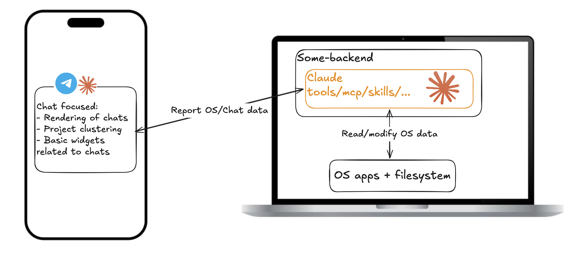
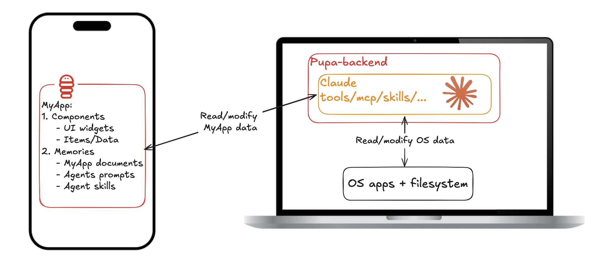

## Four steps, one question

[Keep what you build with your agent](/blog/packaging-agentic-experiences)
told the story from the user's side: you chat, an app appears, you keep it,
you hand it to a friend. This post is the companion for people who want to
see the machinery.

One question runs through all of it. The thing you and your agent built
together — *where does it live, and what can it do there?* There are four
answers in common use today. Each step fixes something the one before it got
wrong. The last one changes what the agent is pointed at.

## Step 1: a skill

A skill is a folder: a markdown file telling the agent how to do something,
maybe a script or two beside it. Put a few of those next to your MCP servers
and your hooks and you have the setup most developers live in today — Claude
on the laptop, reading and modifying OS apps and the filesystem directly.

This is the most capable configuration there is, and the most personal. It's
also the least portable. The session's output is a transcript plus whatever
files got written. The setup itself is welded to one machine, tangled with
your credentials and paths, and was never designed to be handed to anyone.
When the laptop goes, the experience goes with it.

## Step 2: a plugin

Same diagram. That's the point.

A plugin bundles skills, MCP servers, scripts and hooks into one installable
unit with a marketplace behind it. It solves distribution, and solves it
properly: versioned, one command, someone else's carefully tuned setup
running on your machine in seconds.

What it doesn't change is where the agent meets you. That's still a terminal.
One of those scripts can put up a dashboard, and people do, but it's a page
the script drew: the agent can't hold it as state, it doesn't outlive the
run, and it doesn't come with you to the phone. A plugin makes the *setup*
portable. The *experience* still evaporates when the session ends.

## Step 3: a remote control for your agent

Then the phone. Agent-control apps put the agent behind a backend and a
polished client in front: sessions grouped into projects, diffs to approve,
a notification when a long run finishes. This is where most agent products
are right now, and it is a genuine quality-of-life jump — the agent keeps
working while you're away from the desk.

Look at the arrow, though. It points one way. The backend *reports* session
and OS data to the app. What you're holding is a readout of work happening
on a machine somewhere else, not a workspace. The widgets aren't tools the
agent holds, so it can't act on what you're seeing, and you can't act on it
either except by typing more chat.

That's the distinction worth naming, and it's the whole reason for the next
step: these apps give the agent a **native interface**, not a **native
environment**. The app is a window onto your laptop. Nothing lives in it that
outlasts the session — nothing you could keep, grow, version, or hand to
someone else.

## Step 4: a MyApp, a plugin with a native app attached

The bottom panel is Pupa. The laptop half is unchanged: Claude still runs
with its tools against the OS, now behind your own pupa-backend. What's new
is the other end of the arrow, and that the arrow points both ways. The
backend doesn't report to the app; it *reads and modifies* it.

That's possible because there is now a structured thing to modify. A
**MyApp** is two halves:

- **Components:** typed UI blocks (tracker, calendar, checklist, chart,
  chat room) holding items of data, linkable to each other. To the agent
  each component is a first-class tool: it adds a row, moves an event,
  links a diary entry to a day, as real actions you watch land.
- **Memories:** a long-lived filesystem carried by the app: its documents,
  the agent's prompts, and its skills.

Read it as a plugin that grew a body. The prompts, skills and scripts a
plugin would ship are still in there, in Memories. What's added is a native
app for them to operate, and the state that app accumulates while they do.

## The four steps side by side

| | Surface | Durable state | What ships | Capability |
|---|---|---|---|---|
| **Skill** | your terminal | files the run wrote | a folder you copy | the host machine's |
| **Plugin** | your terminal | files the run wrote | a versioned bundle from a marketplace | the host machine's |
| **Remote control app** | a chat client on your phone | session history | nothing; you sign in | the machine the session runs on |
| **MyApp** | a native app the agent operates | components and memories, on device | one `.pupa` file | granted fresh by whichever host runs it |

Every step keeps the one before it: a MyApp still has skills in it, still
installs like a plugin, still lets you watch a run from your pocket.

## Agents don't need pixels, they need structure

The design bet behind the components is that a human app lives or dies on
visual polish, while an agent operates a component through its fields, links
and state, and never sees the styling. That tolerance is leverage. There's
no standard agent UI yet, so instead of chasing pixel-perfect surfaces, Pupa
standardises a small set of plain, well-typed blocks: unfussy to render, and
expressive enough to build real experiences on because they compose and
cross-link.

Being native is what makes those blocks worth having. A component can fire a
local notification, land on the share sheet, sit on the home screen, and stay
readable with the backend offline. The app stops being a window onto a
session and becomes a place the rest of the phone can reach.

## What travels, what stays

Notice the laptop keeps its "read/modify OS data" arrow in every panel. The
host never stops being the capable half. Pupa's split is about which side
owns what:

- **The MyApp owns structure and intent:** the components, the memories,
  the prompts and skills, the way it all links together.
- **The host owns capability:** tool access, credentials, private files,
  the live web. These are granted fresh on whatever machine the app runs
  on, and never travel with it.

That split is what makes the bundle safe to pass around. An exported MyApp
is a single `.pupa` file of inert JSON: the app tree plus its memories,
with no code inside. The receiving client rebuilds the app from the
description (so bundles survive version drift), shows a confirm sheet naming
the app and any agent prompts, and nothing runs until that host grants its
own abilities.

One file replaces the pile: harness config, docs, plugins, personal assets,
workflows. The keys stay home.

## Where the standard goes

The component set is an extension point, not a fixed menu. New kinds
(multi-agent chat rooms were the first) are built against the same two
primitives as the built-ins, render anywhere, and export in the same
bundle. How that works, and how it stays safe to share, is covered in
[Build your own component](/blog/custom-components-and-portability).

And distribution is deliberately boring: the [marketplace](/marketplace) is
an HTTPS `index.json` pointing at `.pupa` files. Inert data, an open
client, and arrows that point both ways. That's the whole architecture.
