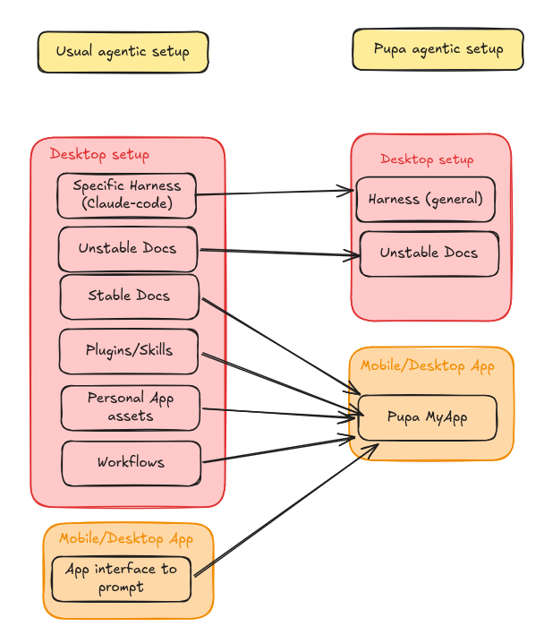

## One diagram, three stages

[Keep what you build with your agent](/blog/packaging-agentic-experiences)
told the story from the user's side: you chat, an app appears, you keep it,
you hand it to a friend. This post is the companion for people who want to
see the machinery.

Everything below is a walk through one diagram, top to bottom. Each panel is
a different answer to the same question: *where does the agent meet its
user, and what flows across that boundary?*

## Stage 1 — an agent on your machine

The top panel is the setup most developers live in today: Claude on the
laptop, armed with tools, MCP servers and skills, reading and modifying OS
apps and the filesystem directly.

This is the most capable configuration there is, and the most personal. It's
also architecturally a dead end for everyone except you. The session's
output is a transcript plus whatever files got written. The setup itself —
the instructions, the skills, the server config — is welded to one machine,
tangled with your credentials and paths, and was never designed to be handed
to anyone. When the laptop goes, the experience goes with it.

## Stage 2 — a chat app in front of a backend

The middle panel is where most agent products stop. The agent moves behind a
backend; a phone app goes in front. The app renders chats, clusters them
into projects, and shows a few widgets about the conversation.

Look at the arrow between them: it points one way. The backend *reports* OS
and chat data to the app. The surface you're looking at is a readout, not a
workspace — the widgets aren't tools the agent holds, so it can't act on
what you're seeing, and you can't act on it either except by typing more
chat. And since the app's only durable state is a chat history, nothing you
set up in it exists as a unit you could keep, version, or share.

You gained reach — the agent is on your phone now — and lost the thing that
made stage 1 interesting: a shared surface both sides can work on.

## Stage 3 — an app the agent operates

The bottom panel is Pupa. The laptop half is unchanged: Claude still runs
with its tools against the OS, now behind your own pupa-backend. What's new
is the other end of the arrow — and that the arrow points both ways. The
backend doesn't report to the app; it *reads and modifies* it.

That's possible because there is now a structured thing to modify. A
**MyApp** is two halves:

- **Components** — typed UI blocks (tracker, calendar, checklist, chart,
  chat room) holding items of data, linkable to each other. To the agent
  each component is a first-class tool: it adds a row, moves an event,
  links a diary entry to a day, as real actions you watch land.
- **Memories** — a long-lived filesystem carried by the app: its documents,
  the agent's prompts, and its skills.

The design bet behind the components is that **agents don't need pixels,
they need structure**. A human app lives or dies on visual polish; an agent
operates a component through its fields, links and state, and never sees the
styling. That tolerance is leverage. There's no standard agent UI yet, so
instead of chasing pixel-perfect surfaces, Pupa standardises a small set of
plain, well-typed blocks — unfussy to render, and expressive enough to
build real experiences on because they compose and cross-link.

## What travels, what stays

Notice the laptop keeps its "read/modify OS data" arrow in every panel. The
host never stops being the capable half. Pupa's split is about which side
owns what:

- **The MyApp owns structure and intent** — the components, the memories,
  the prompts and skills, the way it all links together.
- **The host owns capability** — tool access, credentials, private files,
  the live web. These are granted fresh on whatever machine the app runs
  on, and never travel with it.

That split is what makes the bundle safe to pass around. An exported MyApp
is a single `.pupa` file of inert JSON — the app tree plus its memories,
with no code inside. The receiving client rebuilds the app from the
description (so bundles survive version drift), shows a confirm sheet naming
the app and any agent prompts, and nothing runs until that host grants its
own abilities.

One file replaces the pile: harness config, docs, plugins, personal assets,
workflows. The keys stay home.

## Where the standard goes

The component set is an extension point, not a fixed menu. New kinds —
multi-agent chat rooms were the first — are built against the same two
primitives as the built-ins, render anywhere, and export in the same
bundle. How that works, and how it stays safe to share, is covered in
[Build your own component](/blog/custom-components-and-portability).

And distribution is deliberately boring: the [marketplace](/marketplace) is
an HTTPS `index.json` pointing at `.pupa` files. Inert data, an open
client, and arrows that point both ways — that's the whole architecture.
