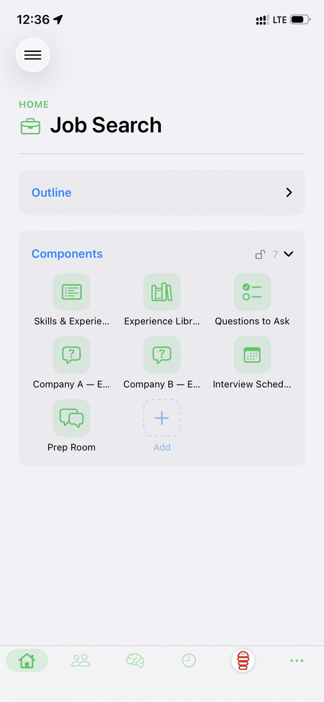
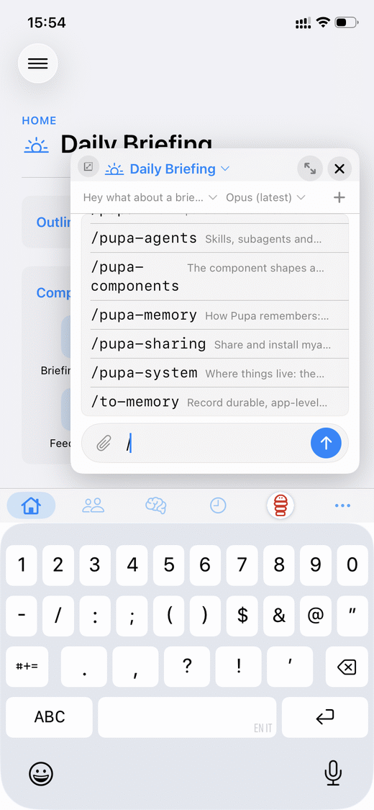

## Start with a conversation

You're chatting with your agent, and halfway through you realise you need
somewhere to *see* things. Not another wall of text — a place. A little
dashboard: a few rows you can sort, a calendar, a checklist you and the agent
both keep up to date.

So you ask for one, and it appears next to the chat. From then on the agent
doesn't just *tell* you things — it *works in* that dashboard with you, adding
rows and moving items as real actions while you watch and edit the same surface.

That small moment — "I need a place for this" — is the whole idea. This post is
about what happens when you keep those places, connect them, and hand them to
someone else.

## What we believe

At Pupa we think a surprising amount of what people want from agents can be
covered by a handful of **basic, well-made components** — a tracker, a calendar,
a checklist, a chart, a chat room — **and by how those pieces relate to each
other**. Standardise the blocks and the connections between them, and you get
something you can build once, refine over time, and share as a single thing.

Here's what makes that standard reachable: **agents don't need a pixel-perfect
UI to work**. A human app lives or dies on visual polish, but an agent operates
a component through its *structure* — fields, links, state — not its styling.
That tolerance isn't a compromise, it's leverage: it offsets the fact that
there's no standard agent UI experience yet. So rather than chase pixel-perfect
surfaces for humans, we propose **general components** — plain, well-typed blocks
that aren't fussy to render but are powerful to build agentic experiences on.

The valuable output of an agent session usually isn't the transcript, and it
isn't a folder of files. It's the **experience you configured** — the shape of
the workspace, the way the parts connect, the habits baked in. Pupa turns that
into an app: a **MyApp** that the agent operates natively, that persists across
projects, and that you can package up and give to a friend.

## Why files aren't enough

You can already ship a lot: a plugin, a bundle of prompts, a folder of notes.
But those are **things the agent reads** — not **an app the agent uses**. None of
them give you a live workspace you and the agent edit together, that remembers
itself across projects. So every good setup gets rebuilt from scratch each time,
and "sharing" means handing over notes and hoping.

A MyApp closes that gap. It's typed components that reference each other, plus a
long-lived **Memories** store and the agent's own configuration. That bundle —
not a chat log — is the thing worth keeping and passing on.

## The ladder — four examples

The simplest useful thing is a single component. From there you climb: connect
components, split work between your host and your app, and eventually add new
components of your own. Here's each rung with a real example.

### L0 — One component, with a nudge

Snap a photo of a prescription. The agent reads the schedule off it and builds a
small MyApp for you: a **calendar** of every dose, plus a **notification** each
time it's time to take one. That's it — one component doing one honest job, with
reminders that actually fire on your device.

No pipeline, no config. You took a picture; you got a working little app that
keeps you on schedule.

### L1 — Components that talk to each other

Now make it richer. Add a **tracker** for a short daily diary: how you're
feeling, any side effects, whether the medicine seems to be helping. Then **link**
each diary entry to its day on the calendar.

Suddenly the two pieces reference each other. Looking at a rough day on the
calendar, you can jump straight to what you wrote; reviewing the diary, you can
see exactly which doses it lines up with. This is the standardisation paying off:
the value isn't in either component alone, it's in the **connection** between
them.

### L2 — Your host does the work; your MyApp keeps it clear

Bigger example: a **job search**.

Some of this is open-ended, one-off work that belongs on **your host** (your
laptop, your agent, your tools): searching the web for roles, reading company
pages, drafting and tailoring a CV or cover letter. It's fast, messy, and mostly
disposable.

The rest is durable and worth keeping tidy, so it lives in the **MyApp**: a
tracker of applications and their stages, a calendar of interviews, and your own
material — the experiences you draw on, the persona you present, the questions
you like to ask. The app is where information stays *organised*; the host is
where it gets *fetched and produced*.

That split is the point:

- **What stays in the app:** your CV and preferences, your method, the structured
  record of where you've applied. Portable, and yours.
- **What's re-earned on each host:** live web access, credentials, and any
  private files. These don't travel — they're granted fresh wherever the app
  runs.

To make this repeatable, you can add a small **Pupa skill** — a short playbook,
available as a `/command` — on **how to manage your information**: what belongs in
Memories versus what the host should look up fresh each time, and how to keep the
two from drifting. Hand the whole thing to a friend and they inherit your entire
method — minus your private records.

### L3 — Contribute a component

The set of components isn't a fixed menu — it's an **extension point**. If the
five or six built-ins don't cover your idea, you can add a new one against the
same standard, and from then on *anyone's* MyApp can use it.

Take the **slack rooms** component: multi-agent chat built on top of the standard
Pupa gives you. It lets you assemble a fairly custom experience — several agent
personas talking in channels — while still being a plain component that runs on
**any harness**, exports in the same bundle, and links to other components like
everything else. That's the deal: build to the standard, and your new block is
portable by default.

If you want to add your own, start here:
[custom components & the portability policy →](/blog/custom-components-and-portability),
which covers Pupa's design and how to contribute a component.

## The portable unit — the `.pupa` file

When you share a MyApp, it travels as a single `.pupa` file. A few things worth
knowing, without the fine print:

- **It's just data.** The file is inert JSON — the app tree plus its memories.
  There's no code inside; the client rebuilds everything from the description, so
  a bundle from an old version still opens.
- **Importing is careful.** Opening one shows a confirm sheet naming the app and
  any agent prompts, and the import is checked before anything runs.
- **Sharing is one tap.** Export uses the normal system share sheet; you can even
  pack every MyApp into one library file.

## The boundary that keeps it safe

The same split from the job-search example is also the safety story. What travels
is **structure and intent**: the components, the personas, the skills, the way it
all fits together. What's **re-earned** on the new host is **capability**: tool
access, credentials, private data.

Because the bundle is inert, it can't *do* anything until you run it and grant it
your host's abilities. You get someone's whole method without handing them — or
their app — your secrets.

## Why it matters

- **A real unit to share** — a typed app the agent operates, not a pile of notes.
- **A standard to build on** — a few good components and clear connections you can
  refine over time.
- **Open and extensible** — new component kinds come from the community.
- **No lock-in** — inert, inspectable data, rebuilt by an open client.
- **Safe by design** — the app travels; the keys stay home.

## What's next

The follow-on is a **marketplace**: browse and install bundles from inside the
app, with signatures and moderation. Agents will keep talking — Pupa is where a
conversation **turns into an app you can keep, share, and re-run anywhere**.

<!--
DRAFT NOTES — points to work in later (rewrite):

- Portability & ease of use matter MORE as agents gain autonomy. When agents run
  more work on their own, the setup that governs them has to travel safely and be
  simple to hand off. Autonomy raises the bar for both safety and robustness, and
  portability + ease of use are how you meet it.

- Lower the technical level for many users. Current framing still assumes a
  fairly technical reader. A large audience needs the barrier dropped — less
  jargon, more "you took a picture, you got a working app". Make the non-technical
  on-ramp explicit.

- Simple creative personal use case is underserved. There's open space for
  lightweight, personal, creative apps (not just job-search / productivity). No
  one is filling it. Call this out as an opportunity and give a personal-creative
  example.
-->

