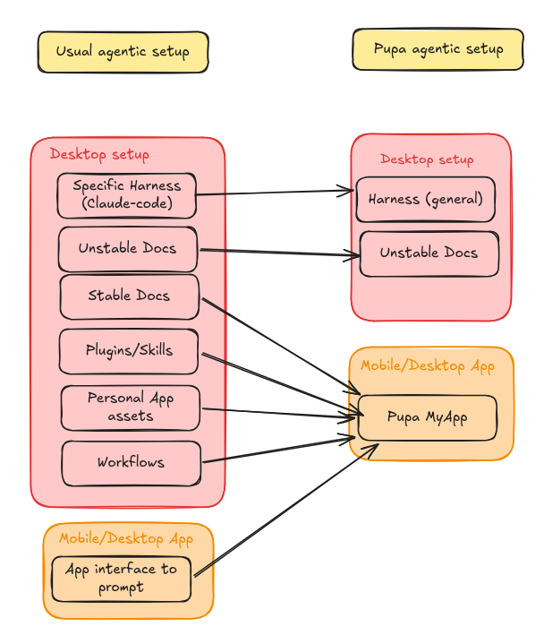

## The thesis

The valuable thing an agent produces isn't a transcript — and it isn't a folder
of files either. It's the **agentic experience** you configured. Shipping
*instructions and assets* is already possible: a Claude Code plugin, a skills
hub, a repo of prompts. What isn't yet possible is shipping a **structured app
the agent operates natively** — typed surfaces it reads and writes *with you*,
persisting as one coherent thing across projects. Pupa **crystallises an
experience into that app structure**, so it can be produced once, refined over
time, and handed to someone who runs it on their own host.

> Pupa turns an agentic experience into a persistent, typed app the agent works
> in with you — and that app is the portable unit.

## The problem — you can ship files, not an app the agent uses

Portability of *content* is largely solved: you can already ship a Claude Code
plugin, a skills hub, a repo of prompts and assets. But those are **instructions
and files the agent references** — not an **app the agent operates**. Nothing
makes the asset a live, typed workspace the agent reads and writes as first-class
tools, that you and it edit together in one surface, and that persists as a
single coherent thing across projects. So every good workflow gets rebuilt per
project, and "sharing" means handing over notes, not a working app.

## What Pupa is

A chat-driven canvas that **moulds into the shape you ask for** — tracker,
calendar, checklist, slack rooms, calculator, charts — backed by a long-lived
**Memories filesystem**. The side-panel chat drives the canvas through frontend
tools; the app speaks plain **AG-UI** over one SSE stream to a **swappable
backend** (FastAPI + LangGraph). Native SwiftUI (iOS / macOS).

The unit is a **MyApp**: typed components that reference each other, plus its
memories and its agent config (orchestrator + personas + skills + crons). A
MyApp *is* a packaged agentic experience — and it's an app the agent uses, not
just files it reads.

## The portable standard — the `.pupa` bundle

- **Inert JSON.** Header + the whole `MyApp` tree + memories. **No executable
  content** — all rebuild logic lives in the app, dispatched by component
  `kind`.
- **Self-contained + forward-compatible.** The app tree is the single source of
  truth, so bundles load across versions.
- **Hostile-validated import.** Size caps, magic/version checks, a settings
  allow-list, memory-path guards, fresh IDs, ref pruning; tap-to-open shows a
  confirm sheet naming the app + agent prompts.
- **Sharing = publishing.** Export is a system Share action; a library bundle
  packs *every* MyApp into one file.

## What actually makes it different

**(a) The asset is an app the agent operates natively.** Typed components the
agent reads and writes as first-class tools, while you watch and edit the *same*
surface.

**(b) It persists as one app across projects.** A solid, repeatable scaffold for
producing, refining, and improving an experience over time.

**(c) Portable experience, local execution — with a setup skill as installer.**
The bundle ships structure and intent but no runtime; on import it runs on
**your** host (your backend, tools/MCP, shell, data).

**The boundary (also the safety story).** What travels: the app structure,
personas, skills, intent. What's re-earned on the new host: tool availability,
credentials, private data. The bundle is inert — it can't act until you grant it
your host's capabilities.

## Levels of packaging (the ladder)

- **L0 — a typed component.** A tracker/chart the agent operates directly.
- **L1 — a questionnaire.** A repeatable intake frozen into a typed form.
- **L2 — a multi-component pipeline.** Cross-linked components modelling a real
  recurring workflow.
- **L3 — a self-improving experience.** Personas, subagents, skills, memory that
  make the app get better with use — plus a setup skill so it installs cleanly
  elsewhere.

## The meta-harness view

A MyApp is itself a small **agent harness** that persists across projects: its
own AGENTS.md orchestrator + subagent personas, skills that become slash commands
and model-loadable playbooks, memories as the long-term store, crons for cadence.
So Pupa isn't one app — it's a **harness that ships harnesses**, and the `.pupa`
bundle + setup skill are how one travels and installs.

## On-ramp example — "Blog Studio"

A one-component MyApp — a kanban tracker of posts moving through *Research →
Outline → Draft → Review → Publish*. Not notes the agent reads — an **app the
agent operates with me**, adding rows and moving stages as first-class actions.
Export it and anyone inherits the same working pipeline.

## Example A — the Questionnaire (L1)

A repeatable intake — onboarding survey, health intake, project brief — as a
typed app the agent fills *with* you: it asks conversationally, validates, and
writes structured answers into typed fields. Export the `.pupa` and anyone runs
the *same* intake for the *same* typed output.

## Example B — the Job Search (flagship, L2/L3)

- **Components:** tracker of applications, calendar of interviews, chart of
  pipeline-by-stage, memories holding CV + preferences.
- **Personas:** *researcher*, *tailor*, *outreach* writer — each with handoff
  limits.
- **A standard setup skill** installs the experience on a new host.
- **Rides your host:** hand it to a friend and they inherit your entire method
  minus your private records.

## Open source & extensible — bring your own component

- **Add your own canvas shape.** The component set isn't a fixed menu — it's an
  extension point, with a documented "adding a component" recipe and
  compiler-enforced completeness.
- **Bring your own design.** The AG-UI client is a standalone Swift package
  (AGUIKit) with no dependency on Pupa's UI.

## Why it matters

- **A real unit to share** — a typed app the agent operates, persisting across
  projects.
- **A standard to refine** — one solid structure to improve experiences over
  time.
- **Open & extensible** — new component kinds and designs come from the
  community.
- **No lock-in** — inert JSON, inspectable, rebuilt by the open client.
- **Safety** — inert bundle + hostile-validated import + a clear travels/re-earned
  boundary.

## Roadmap / close

The follow-on is a **remote marketplace**: store/serve bundles, an in-app
browser, plus signatures and moderation. Agents will keep talking — Pupa is where
an experience **crystallises into an app you package, distribute, refine, and
re-run on any host**.
