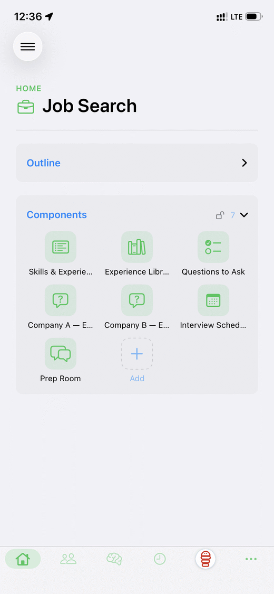

## Start with a conversation

You're chatting with your agent, and halfway through you realise you need
somewhere to *see* things. Not another wall of text: a place. A few rows you
can sort, a calendar, a checklist the two of you keep up to date.

So you ask, and it appears next to the chat. From then on the agent doesn't
just tell you things. It works in that little dashboard with you, adding rows
and ticking items while you watch, and you can edit the same screen by hand
whenever you like.

That moment, "I need a place for this", is the whole idea behind Pupa. This
post is about what happens when you keep those places, let them grow, and hand
them to someone else.

## A photo becomes an app

Say you've just been handed a prescription. Two medicines, one twice a day
with food, the other every second morning. You photograph the label and ask
your agent to keep you on schedule.

It reads the schedule off the photo and builds you a small app: a calendar
with every dose on it, and a reminder that fires on your phone when it's time.
That's the entire setup. You took a picture; you got a working app.

<video src="/videos/myapp-schedule.mp4" controls playsinline preload="metadata" title="Building a MyApp: from a request to a working schedule"></video>

We call these little apps **MyApps**. They're built from a handful of plain,
well-made parts: a calendar, a tracker, a checklist, a chart, a chat room. An
agent doesn't need a beautiful interface to work with you. It needs a few
honest parts it can read and update. So the parts stay simple, and the agent
handles them well.

## It grows

A week in, you want to keep notes. How you're feeling, any side effects,
whether the medicine seems to help. Ask for a small diary next to the
calendar, and have each entry linked to its day.

Now a rough entry in the diary points at the doses it lines up with, and from
the calendar you can jump back to what you wrote. Neither piece is clever on
its own; the link between them is where the value shows up. And a link is
something the agent can make from one sentence.

Everything the app learns lives in its own long-term memory, which we call
**Memories**, so it's all still there next week, and on your other devices
too.

## Make something just for you

Not everything worth building is practical. One of our favourite MyApps is a
bedtime-story studio for a small child: a cast of characters the child
invented, each with a name and a portrait and a temper; a shelf of finished
stories; and an agent that writes tonight's episode with that cast, at the
right length for that bedtime. Every new story goes on the shelf. Every new
character joins the cast.

Nobody sells an app like that. It's too particular: one child, one cast, one
family's in-jokes. Which is exactly the point. When an app takes an afternoon
of chatting to make, rather than a team of engineers, it becomes worth
building things with an audience of one. We think this space is wide open,
and it's where MyApps feel most like themselves.

## It scales when you need it to

The same shape carries real work too. Take a job search. The messy parts
(reading company pages, tailoring a CV, drafting cover letters) happen in
conversation, on your own computer, with your own files and logins. The parts
worth keeping tidy live in the MyApp: a tracker of where you've applied, a
calendar of interviews, your experience and the questions you like to ask.

Notice what the app holds and what it doesn't. Your record and your method
stay in the app. Your logins, your private files and your web access belong
to whatever computer it runs on, granted fresh each time. Your keys stay
home.

## Hand it to a friend

A MyApp travels as a single file, a **`.pupa`**. There's no code inside:
just a description of the app and the memories you chose to include. When a
friend opens it, their own Pupa rebuilds the app from that description and
shows them exactly what's inside before anything runs.

So sharing your medication tracker, your story studio, or your whole
job-search method is one tap on the share sheet. What your friend receives is
the shape of what you built and the habits baked into it. Never your data,
never your logins.

<video src="/videos/export.mp4" controls playsinline preload="metadata" title="Sharing a MyApp: export it as a single .pupa file"></video>

The parts apps are made of are an open set, too. If the built-ins don't cover
your idea, new kinds can be added and shared the same way. How that works,
and how it stays safe, has its own post:
[Build your own component](/blog/custom-components-and-portability).

## Why this matters more now

Agents are starting to do real work while you're not watching: checking
things overnight, keeping records current, sending the reminder before you
knew you needed it. The more they do alone, the more it matters what's
steering them.

With a MyApp, that steering isn't scattered across prompts and config files.
It's one thing you can open, read, carry to another machine, and hand to
someone you trust. An app you can see is an app you can trust with more.

## Where this goes

There's an early [marketplace](/marketplace) where MyApps people have made
can be browsed and opened in your own Pupa. The agents will keep talking
either way. Pupa is for the moment a conversation turns into something you
want to keep.

If you'd rather see the machinery (what the agent actually reads and
writes), there's a technical companion:
[From Claude on your machine to Claude in your app](/blog/from-machine-to-myapp).
